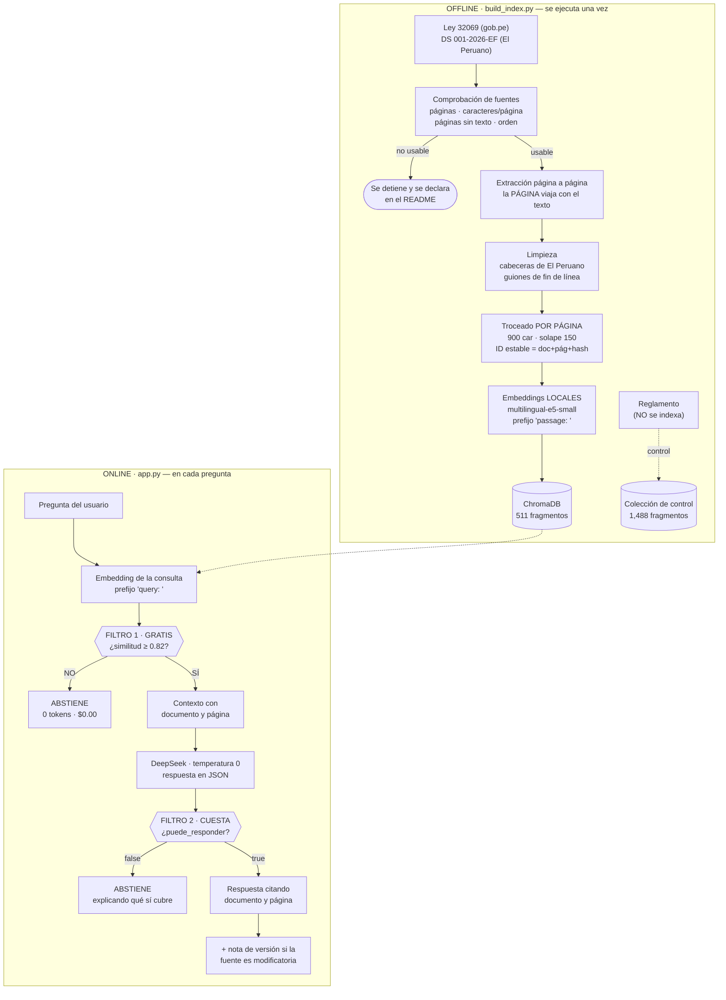
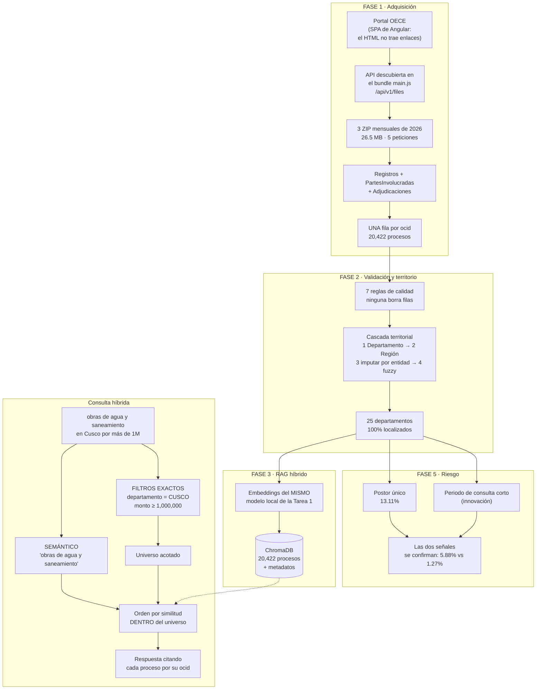

# HW3 — RAG Normativo y Radar de Compras Públicas

**José Miguel Díaz** · Data-Science-Python · [Issue #187](https://github.com/d2cml-ai/Data-Science-Python/issues/187)

Dos herramientas para una MYPE peruana que quiere venderle al Estado y tiene dos
problemas a la vez:

| | Pregunta que responde | Entregable |
|---|---|---|
| **Tarea 1** | *¿Qué dice la ley?* | Asistente RAG sobre la Ley 32069 y el DS 001-2026-EF |
| **Tarea 2** | *¿Qué compra el Estado, y dónde?* | Radar sobre 20,422 procesos de contratación reales |

> Un sistema que responde con seguridad y se equivoca es peor que no tener sistema.
> En las dos tareas, **saber cuándo no responder** es parte del diseño.

---

## Instalación (Windows)

```powershell
# 1. Entorno virtual con Python 3.12
py -3.12 -m venv .venv
.venv\Scripts\activate
python -m pip install --upgrade pip

# 2. Dependencias
pip install -r requirements.txt

# 3. Credenciales
copy .env.example .env
notepad .env          # pega tu DEEPSEEK_API_KEY
```

### Nota sobre PyTorch

`requirements.txt` incluye estas dos líneas, y no son accesorias:

```
--extra-index-url https://download.pytorch.org/whl/cpu
torch==2.14.0+cpu
```

Sin ellas, `pip` descarga la compilación con CUDA (~2.5 GB) que es inútil en una máquina
sin GPU. Con ellas son **124 MB**. El sufijo `+cpu` solo existe en el índice de PyTorch,
así que pip está obligado a buscarlo ahí.

---

## Correr todo en una sola orden

```powershell
python run_all.py
```

Ejecuta el proyecto completo de punta a punta: descarga las fuentes, comprueba que son
legibles, construye los dos índices, calibra los umbrales, evalúa sin coste, hace las
llamadas de prueba al modelo y calcula los indicadores de riesgo.

**Corrida real de referencia: 3.8 minutos y $0.001938 USD.** Es reanudable: lo descargado
no se vuelve a descargar y lo indexado no se vuelve a indexar, así que la segunda corrida
tarda segundos.

| Opción | Para qué |
|---|---|
| `--rapido` | Omite las llamadas de pago al modelo |
| `--solo 1` / `--solo 2` | Una sola tarea |
| `--reconstruir` | Vacía los índices y los rehace |
| `--force-download` | Vuelve a descargar todo |

### Las aplicaciones

```powershell
cd tarea1_rag_normativo  ;  streamlit run app.py
cd tarea2_radar          ;  streamlit run app.py
```

---

## Pipeline de la Tarea 1 — RAG Normativo

Dos procesos separados. El de arriba corre **una vez**; el de abajo, en **cada pregunta**.
La frontera entre ambos es la carpeta `data/`: arriba se escribe, abajo solo se lee. El
proceso online **nunca vuelve a abrir un PDF**.



### Por qué dos filtros y no uno

Porque **un umbral solo es estructuralmente insuficiente**, y está medido:

| Pregunta | Similitud |
|---|---:|
| "¿Cómo preparo un ceviche?" (fuera de dominio) | 0.7934 |
| **"¿Qué plazo tiene el comité para absolver consultas?"** (la responde el Reglamento) | **0.8869** |
| *Media de las 20 preguntas válidas* | *0.8809* |

La pregunta que el sistema **no puede** responder puntúa **por encima de la media de las
que sí puede**. No existe ningún corte que las separe: son del mismo dominio y el mismo
vocabulario jurídico. El filtro 1 (gratis) atrapa lo evidentemente ajeno; el filtro 2 (una
llamada) atrapa lo que solo se puede decidir mirando el contenido.

---

## Pipeline de la Tarea 2 — Radar de Compras Públicas



### Por qué el monto y el departamento son filtros y no embeddings

Medido sobre cinco departamentos, haciendo la misma búsqueda de las dos maneras:

| Departamento | En el **texto** de la pregunta | Como **filtro** |
|---|---:|---:|
| Cusco | 50% | 100% |
| Puno | 40% | 100% |
| Loreto | 70% | 100% |
| **Arequipa** | **0%** | **100%** |
| Piura | 90% | 100% |
| **Media** | **50.0%** | **100.0%** |

La mitad de los resultados son del departamento equivocado si se deja la condición
territorial a los embeddings. Y con los montos es peor: el vector de "un millón de soles"
está cerquísima del de "900,000 soles" —son textos parecidos— pero 900,000 **no cumple**
la condición. **No existe un "mayor que" en el espacio vectorial.**

---

## Resultados

### Tarea 1

| Métrica | Valor |
|---|---:|
| Fragmentos indexados | 511 |
| Recall@1 / @3 / @5 | 0.70 / 0.85 / 0.90 |
| Abstenciones incorrectas | **0 / 20** |
| Umbral calibrado | 0.82 (meseta 0.80–0.84) |
| Costo por consulta | ~$0.00034 |

**Innovación · BM25 frente a embeddings:**

| Estilo de pregunta | BM25 top-3 | Embeddings top-3 |
|---|---:|---:|
| Formal | 71.4% | **100.0%** |
| **Coloquial** | **16.7%** | **50.0%** |

El empresario dice *"carta fianza"*; la Ley dice *"garantía de fiel cumplimiento"*. Cero
palabras en común, así que BM25 no puede encontrarlo. Los embeddings lo recuperaron en la
posición 1.

### Tarea 2

| Métrica | Valor |
|---|---:|
| Procesos | 20,422 |
| Peticiones HTTP | 5 |
| Localizados en un departamento | 100% |
| Recall@1 / @3 / @5 | 0.9167 / 1.00 / 1.00 |
| Adjudicados con un solo postor | 13.11% |

---

## Comparación de embeddings (Tarea 1, Fase 4)

| | Local | API |
|---|---|---|
| Modelo | `intfloat/multilingual-e5-small` | `text-embedding-3-small` |
| Dimensión | 384 | 1536 |
| Coste de indexar 511 fragmentos | **$0.00** | ~$0.0002 |
| Tiempo de indexado | 9.4 s | depende de la red |
| Requiere clave | no | sí |

**¿Cuál elegiría para este caso? El local, y el precio no es la razón principal.**
Indexar este corpus por API cuesta una fracción de centavo; el argumento económico es
irrelevante. Las razones que sí pesan son otras tres: el corpus normativo es **público
pero sensible en volumen** y no hay motivo para enviarlo a un tercero; el sistema debe
**seguir funcionando sin conexión ni clave**, y un índice que depende de una API se cae
cuando la API se cae; y el enunciado exige que el modelo principal corra **localmente**.

> La fila de la API se rellena solo si se define `OPENAI_API_KEY` en `.env`. Sin ella el
> pipeline corre igual y marca esa fila como no ejecutada, en vez de fallar.

---

## Costo real

Precios de DeepSeek verificados el **2026-09-20** en
[api-docs.deepseek.com](https://api-docs.deepseek.com/quick_start/pricing). El precio
**depende de la hora**: son pico 01:00–04:00 y 06:00–10:00 UTC de lunes a viernes; el
resto del tiempo, incluido todo el fin de semana, cuesta **la mitad**.

| Concepto | Pico (USD/M tokens) | Valle (USD/M tokens) |
|---|---:|---:|
| Entrada con acierto de caché | 0.006 | 0.003 |
| Entrada sin acierto de caché | 0.30 | 0.15 |
| Salida | 1.20 | 0.60 |

El sistema aplica la tarifa que corresponde **al instante de cada llamada** y lo registra
en `logs/costos.csv`, incluidas las llamadas fallidas: una tabla que solo cuenta los
éxitos miente sobre lo que costó llegar al resultado.

**Corrida completa de referencia: 8 llamadas, 12,552 tokens de entrada, 1,503 de salida,
$0.001938 USD.**

---

## Verificación de arquitectura

El enunciado exige que el módulo del motor **no importe ninguna librería de interfaz**, y
que el comando de comprobación esté en el README:

```powershell
Select-String -Path tarea*/src/motor.py -Pattern "^\s*(import|from)\s" |
    Select-String "streamlit|telegram|gradio|flask|fastapi"
```

Sin salida = correcto. `run_all.py` lo comprueba automáticamente al terminar.

> El patrón filtra solo las **líneas de import**, no cualquier mención: los comentarios
> de esos archivos hablan de Streamlit a propósito y darían un falso positivo.

---

## Innovaciones incluidas

| # | Innovación | Dónde |
|---|---|---|
| 1 | **BM25 léxico frente a embeddings** sobre preguntas coloquiales | `tarea1/eval/evaluar.py` |
| 2 | **Enlace entre las dos tareas**: el asistente normativo explica la regla del método de contratación de un proceso recuperado por el radar | `tarea2/src/innovacion.py` |
| 3 | **Segunda señal de alerta** (periodo de consulta corto) de la guía de Open Contracting Partnership, cruzada con la de postor único | `tarea2/src/metricas.py` |
| 4 | **GitHub Actions** que corre la evaluación en cada push y falla si Recall@3 cae | `.github/workflows/evaluacion.yml` |

La innovación 2 es la que mejor demuestra que la arquitectura es correcta: **no añade
ningún mecanismo nuevo**. Son veinte líneas que llaman a `motor.responder()` de la otra
tarea. Si el motor no estuviera separado de su interfaz, sería imposible sin duplicar
código.

---

## Estructura

```
HW3_Diaz/
├── run_all.py                  ← genera TODO en una corrida
├── requirements.txt
├── .env.example                variables sin valores
├── guion_video_HW3_Diaz.docx   guion de la presentación
├── docs/pipeline.md            diagramas del video
├── logs/                       material para el video
│   ├── incidencias.md          qué se rompió y cómo se resolvió
│   ├── hallazgos.md            resultados con sus números
│   ├── explicaciones.md        qué es cada archivo y por qué
│   └── estado.md               dónde quedó el trabajo
├── tarea1_rag_normativo/
│   ├── config.yaml             TODOS los parámetros
│   ├── build_index.py          proceso offline
│   ├── app.py                  Streamlit (solo interfaz)
│   ├── src/                    fuentes, limpieza, chunking, embeddings,
│   │                           índice, motor, costos
│   ├── eval/                   25 preguntas + métricas sin coste
│   └── data/{raw,processed,index}/
└── tarea2_radar/
    ├── config.yaml
    ├── build_data.py           proceso offline
    ├── app.py                  dashboard
    ├── src/                    adquisición, validación, territorio,
    │                           motor híbrido, métricas, innovación
    ├── eval/
    └── data/{raw,processed,outputs,index}/
```

---

## Limitaciones declaradas

1. **El Reglamento no está indexado, a propósito.** Muchas preguntas reales solo las
   responde él. El asistente lo dice en vez de improvisar. Está descargado y en una
   colección de control para poder demostrarlo.
2. **Un experimento descartado con datos.** Intenté usar esa colección de control para
   detectar preguntas de Reglamento comparando similitudes. No funciona: con margen 0.01
   detecta 0 de 5 y marca 4 de 20 preguntas válidas como sospechosas. Se documenta en
   `logs/hallazgos.md` (H-02) y el código queda desactivado por bandera.
3. **El patrón de oro de la Tarea 2 es una regla léxica**, así que puede quedarse corto
   con procesos que digan lo mismo con otras palabras. Eso hace la métrica **conservadora**,
   nunca optimista.
4. **La señal de plazo corto cubre el 69% de los procesos**, que son los que declaran
   periodo de consulta. El corte de 3 días es una decisión declarada, no una norma legal.
5. **Una señal de alerta no es una prueba de irregularidad.** Un postor único puede
   deberse a un mercado concentrado, a especialización técnica o a una urgencia
   justificada. El dashboard lo dice, solo nombra entidades públicas y nunca personas.

---

## Fuentes

| Fuente | Enlace | Descarga |
|---|---|---|
| Ley 32069 (actualizada al 19-07-2026) | [gob.pe / OECE](https://www.gob.pe/institucion/oece/colecciones/45029-ley-n-32069-ley-general-de-contrataciones-publicas-y-su-reglamento) | 2026-09-19 |
| DS 001-2026-EF | [El Peruano](https://busquedas.elperuano.pe/dispositivo/NL/2474920-3) | 2026-09-19 |
| Reglamento (control, no indexado) | [gob.pe / OECE](https://www.gob.pe/institucion/oece/colecciones/45029-ley-n-32069-ley-general-de-contrataciones-publicas-y-su-reglamento) | 2026-09-19 |
| Contrataciones abiertas OCDS | [contratacionesabiertas.oece.gob.pe](https://contratacionesabiertas.oece.gob.pe/) | 2026-09-19 |
| Polígonos departamentales | [juaneladio/peru-geojson](https://github.com/juaneladio/peru-geojson) | 2026-09-20 |
| Red Flags in Public Procurement (OCP, 2024) | [open-contracting.org](https://www.open-contracting.org/resources/red-flags-in-public-procurement-a-guide-to-using-data-to-detect-and-mitigate-risks/) | — |
| Funes, un algoritmo contra la corrupción | [Ojo Público](https://ojo-publico.com/especiales/funes/) | — |
