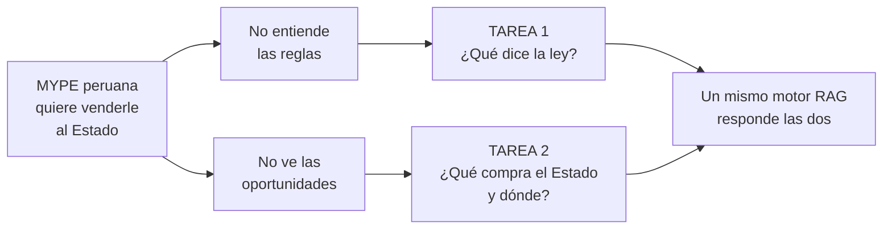
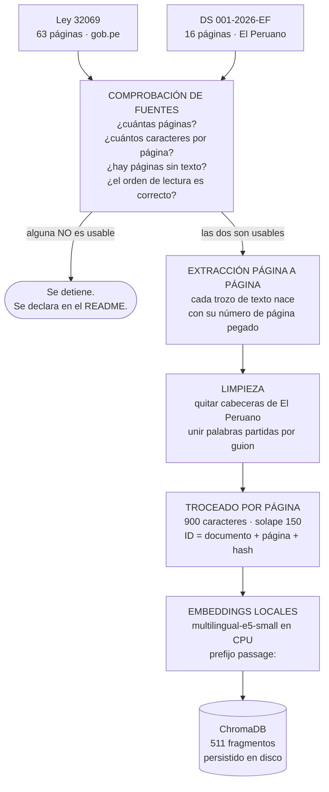
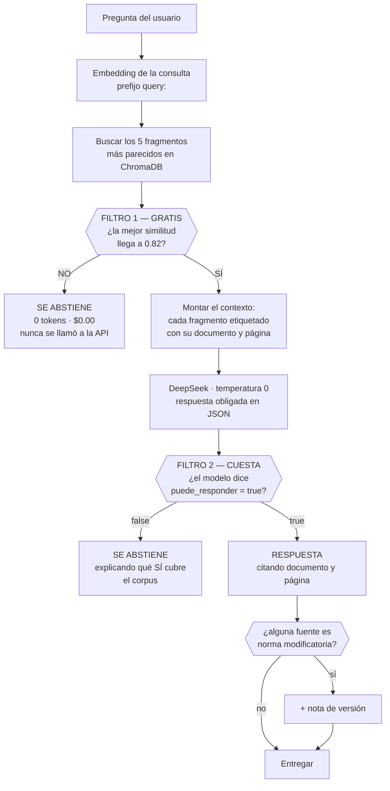
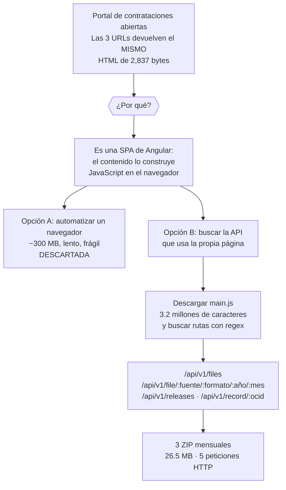
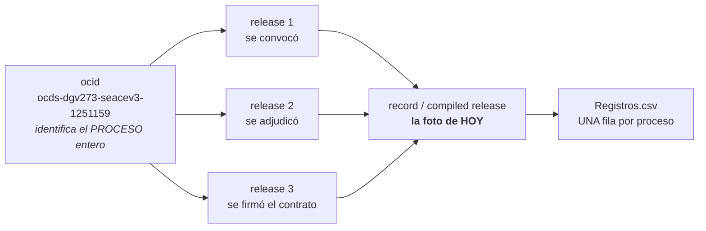
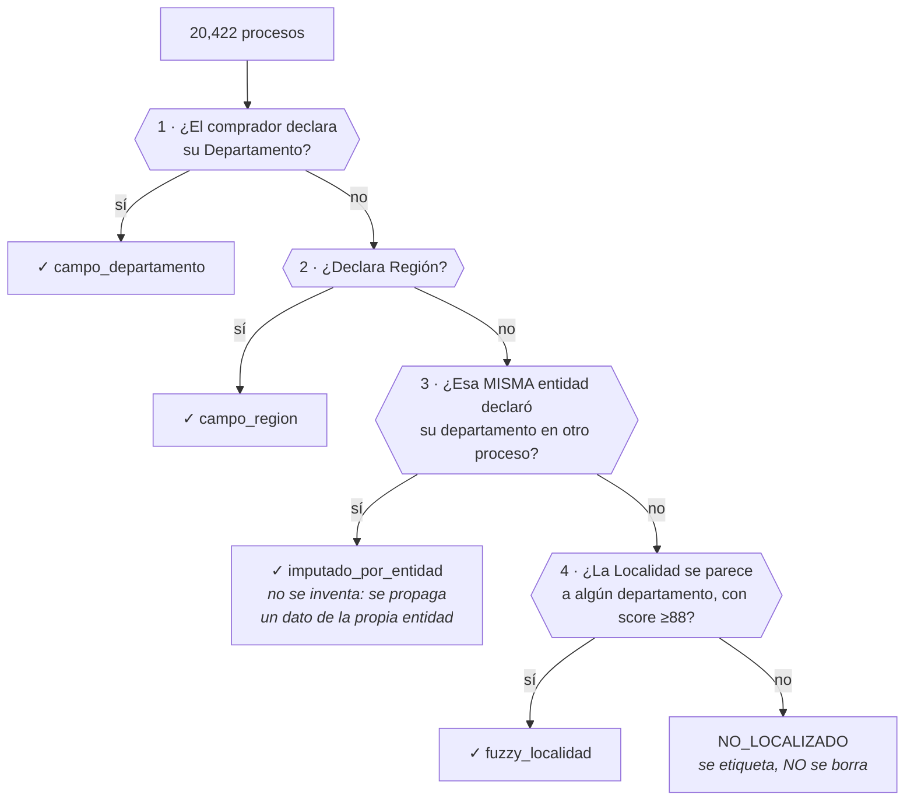
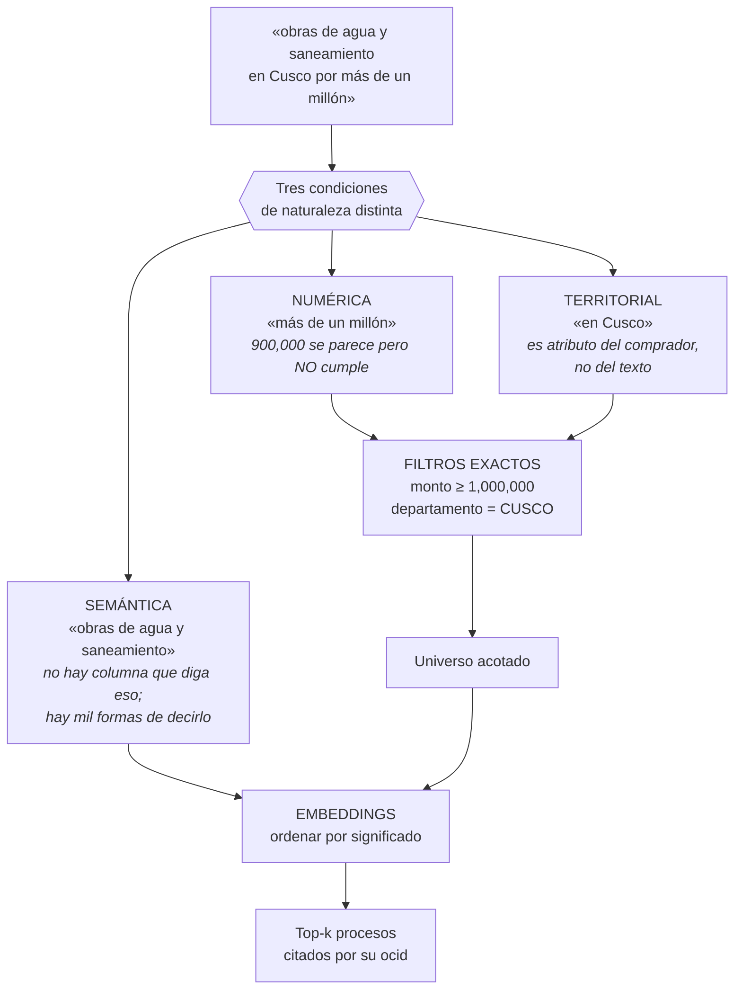
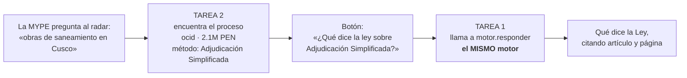

# Diagramas para el video

Estos son los diagramas que se muestran en pantalla durante los primeros 4:30 del video,
**antes de enseñar una sola línea de código**. El enunciado es tajante: si el primer
contenido técnico del video es código, el criterio *"Pipeline explained before code"*
se califica con cero, y son 2.0 de los 8.0 puntos de la presentación.

Los diagramas de aquí están pensados para verse a pantalla completa. GitHub renderiza
Mermaid directamente, así que basta con abrir este archivo y compartir pantalla.

---

## 1. El problema, en un diagrama

**Lo que hay que decir aquí:** son dos problemas distintos del mismo usuario. Contratar
un abogado para cada duda cuesta más que muchos de los contratos a los que podría
postular; y se publican miles de procesos al mes que nadie lee enteros.

---

## 2. Tarea 1 — Lo que pasa UNA VEZ (proceso offline)

**Los tres puntos que el enunciado pide decir aquí:**

1. **Dónde vive el número de página, y por qué es metadato y no texto.** El troceado se
   hace *página por página*, nunca sobre el documento entero. Si se concatenara todo y se
   partiera después, cada fragmento quedaría sin saber de dónde salió, y recuperarlo
   después obliga a buscar el fragmento dentro del PDF — que falla justo en el caso más
   común de un texto legal: párrafos casi idénticos que se repiten.

2. **La comprobación de fuentes va primero, antes de construir nada.** Una fuente
   ilegible cambia el plan entero del proyecto, y descubrirlo el último día es fatal.

3. **El precio de trocear por página** es que un artículo a caballo entre dos páginas
   queda partido. Se compensa con el solape, y es el intercambio correcto: mejor un
   fragmento algo más corto que una cita equivocada.

---

## 3. Tarea 1 — Lo que pasa en CADA PREGUNTA (proceso online)

**El punto donde el sistema decide no llamar al LLM** es el rombo del FILTRO 1. Hay que
señalarlo explícitamente en el video: el enunciado lo pide por su nombre.

**Por qué hacen falta dos filtros** — esta es la tabla que se enseña justo después:

| Pregunta | Similitud | ¿Quién la atrapa? |
|---|---:|---|
| "¿Cómo preparo un ceviche?" | 0.7934 | Filtro 1, gratis |
| "¿Cuál es la capital de Francia?" | 0.7626 | Filtro 1, gratis |
| **"¿Qué plazo tiene el comité para absolver consultas?"** | **0.8869** | **Filtro 2** |
| *Media de las 20 preguntas válidas* | *0.8809* | — |

La tercera fila es el argumento entero: **una pregunta que el sistema no puede responder
puntúa por encima de la media de las que sí puede.** No hay ningún umbral que las separe,
porque son del mismo dominio y el mismo vocabulario.

---

## 4. Tarea 2 — De un portal sin enlaces a 20,422 procesos

**La frase para el video:** cuando un portal no devuelve nada útil al scraper, la pregunta
correcta no es *"¿cómo simulo un navegador?"* sino *"¿de dónde saca sus datos el
navegador?"*.

**El argumento de bulk contra API:** la API pagina de 10 en 10. Reunir 20,422 procesos
por ahí serían unas 2,000 peticiones; por bulk fueron **5**. La API se usa para lo que sí
es buena: novedades recientes y consultar un proceso concreto por su `ocid`.

---

## 5. Tarea 2 — OCDS: release, record y ocid

- El **ocid** es el hilo que cose todo el proceso, desde la planificación hasta la
  liquidación.
- Un **release** es *una novedad*: se convocó, se adjudicó, se firmó.
- Un **record** es la **foto actual**: el resultado de aplicar todos los releases en orden.

Para un radar de oportunidades interesa el record, porque responde *"¿en qué estado está
hoy?"* y no *"¿qué pasó el martes?"*. Por eso la unidad de análisis es **una fila por ocid**.

---

## 6. Tarea 2 — La cascada territorial

**El criterio del enunciado**, literal: *"Silently dropping bad rows is a failing
approach. Dropping them with a logged, justified rule is a passing approach. Correcting
the recoverable ones and reporting the recovery rate is an excellent approach."*

Por eso ninguna regla borra filas: cada una marca, cuenta y declara qué se hizo.

**Resultado:** 100% localizados, los 20,422.

---

## 7. Tarea 2 — La consulta híbrida

**El orden importa:** primero se acota el universo con condiciones exactas, después se
ordena lo que queda por parecido. Al revés produciría menos de *k* resultados cuando el
filtro es selectivo, porque los *k* mejores globales pueden no cumplir ninguna condición.

**Y esto es lo que pasa medido** (el departamento en el texto frente a como filtro):

| | Cusco | Puno | Loreto | Arequipa | Piura | **Media** |
|---|---:|---:|---:|---:|---:|---:|
| En el texto | 50% | 40% | 70% | **0%** | 90% | **50%** |
| Como filtro | 100% | 100% | 100% | 100% | 100% | **100%** |

---

## 8. Cómo se conectan las dos tareas (innovación)

Son **veinte líneas de código**. No añaden ningún mecanismo: solo llaman a la función del
motor de la otra tarea. Si el motor no estuviera separado de su interfaz, esto sería
imposible sin duplicar código — y esa es exactamente la razón por la que el enunciado
exige que el motor no importe Streamlit.

Las dos preguntas del proyecto quedan respondidas en la misma pantalla.
